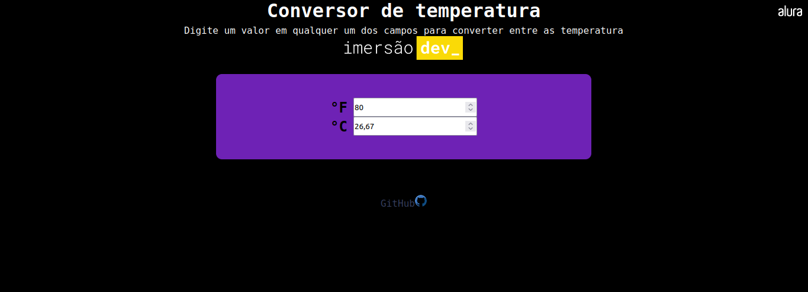
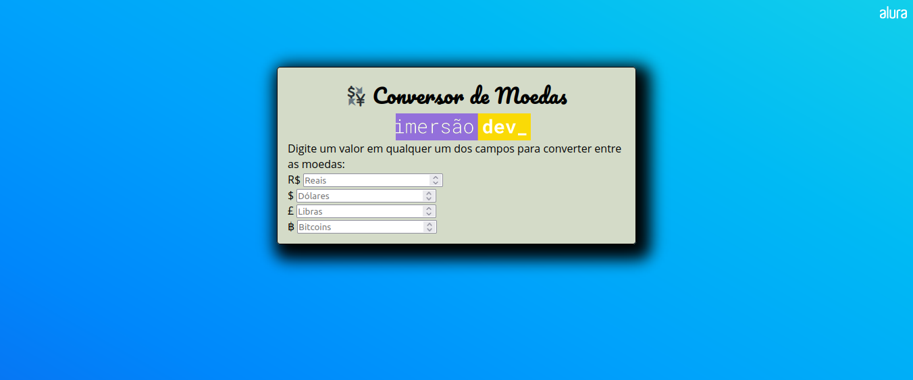
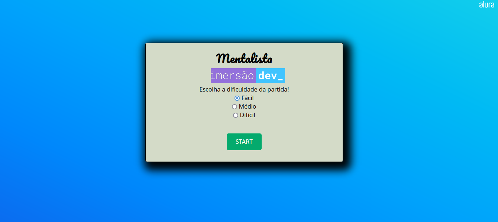

 ## 💻 Sobre
 
 Com a proposta de desenvolver projetos durante 10 dias, a [Alura](https://www.alura.com.br) apresenta mais uma Imersão Dev focada em um público que nunca programou antes.
 
 ## 📚 Roteiro

- [x] Dia 01: Calculadora de média
- [x] Dia 02: Conversor de moedas
- [x] Dia 03: Mentalista 
- [ ] Dia 04:
- [ ] Dia 05:
- [ ] Dia 06:
- [ ] Dia 07:
- [ ] Dia 09:
- [ ] Dia 10:
  
## 📝 Tecnologias

- HTML
- CSS
- Javascript

## ✨ Resultados

### Dia 01

 

**Desafios**: 
- Dizer se o aluno foi aprovado ou não dependendo das notas;
- Estilizar a página;
- Escrever na página o que foi escrito no código;
- Conversor de temperaturas;

 

**Resultados**:

### Dia 02

 

**Desafios**:
- Adicionar outras moedas para converter.
- Conversor de quilômetros para anos luz e verificar o tempo que demora para ir de uma estrela para outra.
- Conversor de temperaturas entre farenheit, kelvin e celcius.
- Adicionar uma linha ao projeto desenvolvido para que apareça o valor em bitcoin.

**Resultados**:

### Dia 03

 

**Desafios**:
- Adicionar um número de tentativas para a pessoa tentar acertar e imprimir a resposta no final.
- Quando a pessoa errar, deixar na mensagem se o número chutado é maior ou menor que o número secreto.

**Resultados**:

### Dia 04

 

**Desafios**:

**Resultados**:

