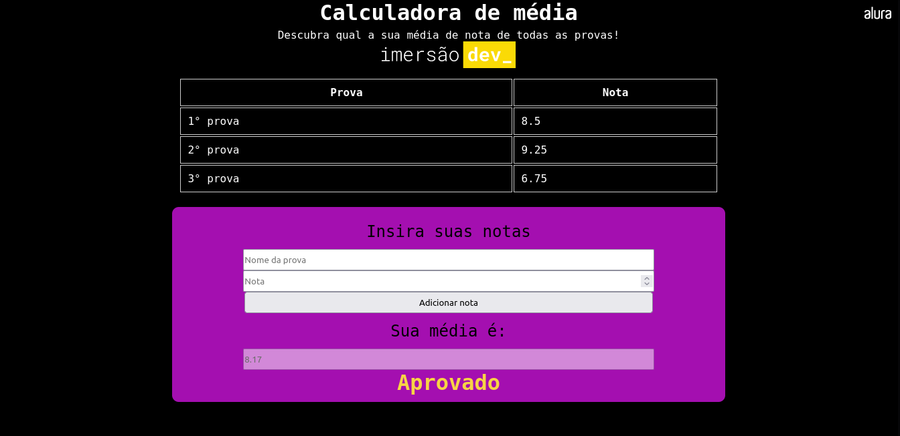

 ## 💻 Sobre
 
 Com a proposta de desenvolver projetos durante 10 dias, a [Alura](https://www.alura.com.br) apresenta mais uma Imersão Dev focada em um público que nunca programou antes.
 
 ## 📚 Roteiro

- [ ] Dia 01: Calculadora de média
- [ ] Dia 02: 
- [ ] Dia 03: 
- [ ] Dia 04:
- [ ] Dia 05:
- [ ] Dia 06:
- [ ] Dia 07:
- [ ] Dia 09:
- [ ] Dia 10:
  
## 📝 Tecnologias

- HTML
- CSS
- Javascript

## ✨ Resultados

### Dia 01

**Desafios**: 
- Dizer se o aluno foi aprovado ou não dependendo das notas;
- Estilizar a página;
- Escrever na página o que foi escrito no código;
- Conversor de temperaturas;

**Resultados**:

